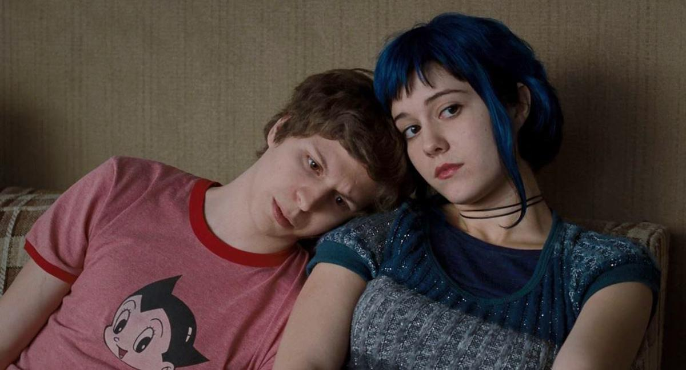
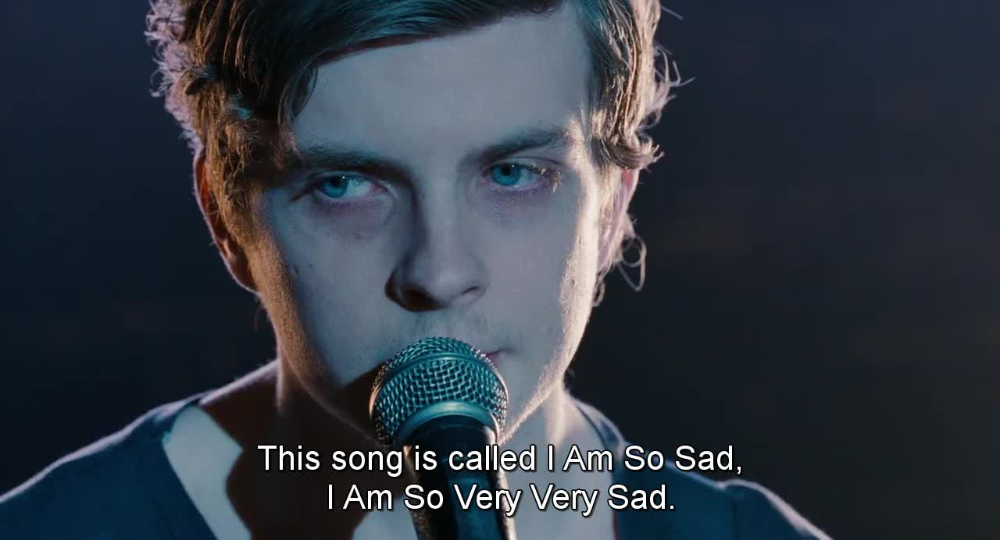
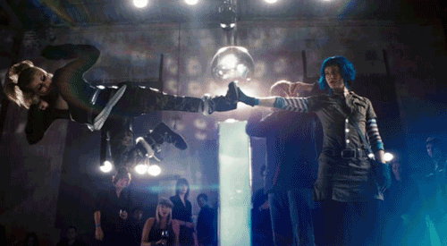

#+TITLE: List of my favorite movies
#+AUTHOR: Suraj Kushwah
#+LANGUAGE: en
#+OPTIONS: num:nil
#+SETUPFILE: https://blog.bugswriter.com/static/theme.setup

[ [[https://blog.bugswriter.com][home]] / [[https://bugswriter.com/contact][contact]] / [[https://bugswriter.com/donate][donate]]]

* Hollywood movies
** The Social Network (2010)
   Mark Zuckerberg creates a social networking site, Facebook, with his friend Eduardo's help.
   Though it turns out to be a successful venture, he severs ties with several people along the way.
   - Year: 2010
   - Genre: Drama/History
   - Rotten Tomatoes: 96%
   - Torrent: [[./assets/movies/torrents/the-social-network.torrent][The Social Network (2010) 1080p BrRip x264 - 1.2GB - YIFY]]
   #+CAPTION: A hacking scene from the movie.
   
   
   *My thoughts*
   
   This movie changed my life.
   How?
   This is the point when I started learning html, basically it was my starting point into computers.
   I started learning web dev because I got inspired with this movie.

   #+CAPTION: Jesse Eisenberg smiling (Scene from The Social Network)
   
   
   [[https://en.wikipedia.org/wiki/Jesse_Eisenberg][Jesse Eisenberg]] is my favorite actor. I like all of his movies. He played [[https://en.wikipedia.org/wiki/Mark_Zuckerberg][Mark Zuckerberg]] role
   and he was brillant. I am not a fan of Mark Zuckerberg, but I fell in love with this movie
   character played by Jesse.
   
   This movie is directed by [[https://en.wikipedia.org/wiki/David_Fincher][David Fincher]].
   I kinda like every movie directed by David Fincher, he turn even a simple scene into an Art.
   
** Never Let Me Go (2010)
   Kathy, Tommy and Ruth are raised in an idyllic environment at Hailsham,
   a boarding school. Even as they deal with pangs of love, a teacher lets
   it slip that their fate has already been written.
   - Year: 2010
   - Genre: Sci-fi/Romance
   - Rotten Tomatoes: 71%
   - Torrent: [[./assets/movies/torrents/never-let-me-go.torrent][Never Let Me Go (2010) 1080p BrRip x264 - YIFY]]

   #+CAPTION: A scene from the film.
   

   *My thoughts*
   
   _I love this movie_. It's based on a /Kazuo Ishiguro's 2005 novel Never Let Me Go/.
   It's really hard to put in words but all I can say is, for me _this movie shows the
   value of your life_. I love drama movies and this is one of the best I got.

   #+CAPTION: Screenshot from the movie.
   

   I strongly recommend you this movie. It will make you cry. I mean I hardly cry watching
   movies, but this was tough for me too. [[https://en.wikipedia.org/wiki/Andrew_Garfield][Andrew Garfield]] did really awesome acting. This
   movie is not a horror movie but it left a sense of fear inside you. But if you are into
   reading novels, then I will recommend reading novel.
     
** Scott Pilgrim vs the World (2010)
   Scott Pilgrim meets Ramona and instantly falls in love with her.
   But when he meets one of her exes at a band competition, he realises
   that he has to deal with all seven of her exes to woo her.
   - Year: 2010
   - Genre: Action/Romance/Comedy
   - Rotten Tomatoes: 82%
   - Torrent: [[./assets/movies/torrents/scott-pilgrim-vs-the-world.torrent][Scott Pilgrim Vs The World 2010 1080p BluRay HEVC H265 BONE]]

   #+CAPTION: Cute scene from the film.
   
   
   *My Thoughts*

   This movie is a pure Art. I love quick clever humor. This movie makes me laugh /real hard/.
   Movie goes very quick, So no point of getting bored.

   #+CAPTION: I love all songs of this movie.
   
   
   #+CAPTION: Every little joke is adorable.
   

   #+CAPTION: Badass battle scenes by Ramona is satisfying to watch.
   
     
   You can't find any movie similar to this. It's a very unique movie to watch.
   
** Mother (2017)
   A poet and his wife lead a tranquil existence in a burnt-out house.
   However, when uninvited guests come barging in, the couple's life
   turns chaotic and shocking events unfold.
   - Year: 2017
   - Genre: Horror/Thriller
   - Rotten Tomatoes: 68%
   - Torrent: [[./assets/movies/torrents/mother.torrent][Mother! (2017) [1080p] [YTS] [YIFY]​]]

   #+CAPTION: Movie poster + Scene combined.
   

   *My Thoughts*
   
   This movie will f**k you up completely. It's will confuse you. In start you might
   end up getting bored and in the last you might end up getting frustrated.

   I have to say [[https://en.wikipedia.org/wiki/Jennifer_Lawrence][Jennifer Lawrence]] did brilliant acting, This is first time I love her role,
   100 times better than [[https://en.wikipedia.org/wiki/The_Hunger_Games][The Hunger Games]].

   I want you remember some points before watching this movie.

   - +This is a horror movie+. It's not!
   - Finish the whole movie carefully, even if it makes no sense.
   - Don't forget to watch [[https://youtu.be/IdlOj1n3vXA][mother! (2017) Ending Explained + Analysis]] after the movie.

   #+CAPTION: A scene from the film.
      

   I must say this movie is way too deep and clever written. I love the ending, all the
   drama and weirdness this movie holds.
   If you like crazy thrillers then give it a shot!
   
   
** If I Stay (2014)
   I like drama movies and if I stay is a full drama.
   I love this movie.
   #+CAPTION: A scene from the movie.
   

* Korean Movies
** Il Mare
** My Girl and I
** Windstruck
** A man who was Superman
** My sassy girl
** The Classic
   
* Bollywood movies
* Anime movies  
