#+TITLE: Imagemagick
#+AUTHOR: Suraj Kushwah
#+EMAIL: suraj@bugswriter.com
#+SETUPFILE: https://blog.bugswriter.com/static/theme.setup

[ [[https://blog.bugswriter.com][home]] / [[https://bugswriter.com/contact][contact]] / [[https://bugswriter.com/donate][donate]]]

* Introduction
  Imagemagick is a CLI tool which allow to edit image.
  In simple terms. It's command line gimp. 
  It is really powerful and it's good to know the basics,
  so you can do some basic image editing stuff without
  any GUI image editor.
  
* Lets start with simple tool: =display=
  =display= is a tool comes with imagemagick which is a
  simple image viewer.
  #+begin_src sh
    display sample.jpg
  #+end_src
  #+CAPTION: Sample image which I'll use in this tutorial.
  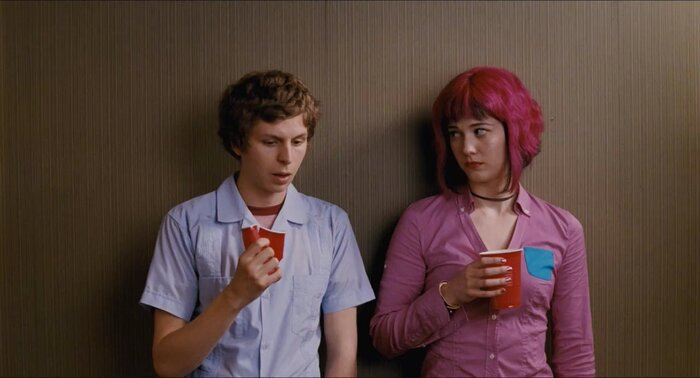
  
* Add effects with =convert=
  Lets ride on *How to* train of =convert= command and see
  what kind of effects we can easily apply by using imagemagick.
** How to convert image format?
   Many people don't know how to do something so basic like.
   *Converting jpg image into png*
   With imagemagick's convert tool it is pretty simple to do.
   #+begin_src sh
     convert sample.jpg output.png
   #+end_src
   yes that's it!
   You can also make gif out of multiple images.
   #+begin_src sh
     convert *.png output.gif
   #+end_src

** How to negate image?
   =convert= is another tool which comes with imagemagick.
   You can use =convert= to achieve lot of effects.
   Here is the example of *negate*:
   #+begin_src sh
     convert -negate sample.jpg output.jpg
   #+end_src
   #+CAPTION: Image after the negate command
   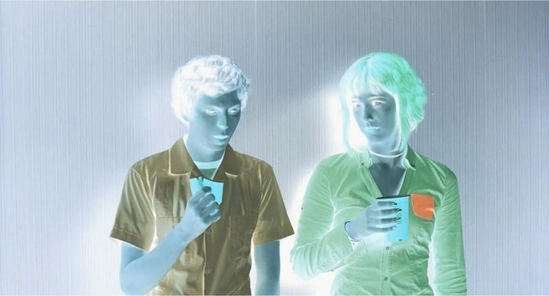

** How to monochrome image?
   Monochrome means truly black and white (no grey),
   we can use =convert= magic to do this.
   #+begin_src sh
     convert -monochrome sample.jpg output.jpg
   #+end_src
   #+CAPTION: Sample image output in monochrome.
   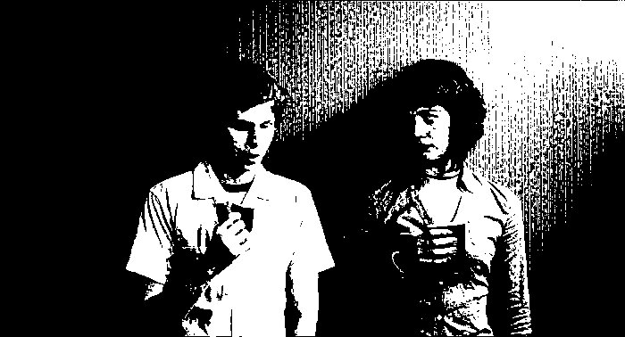

** How to grayscale image?
   Basically we change colorspace to gray.
   #+begin_src sh
     convert -colorspace Gray sample.jpg output.jpg
   #+end_src
   #+CAPTION: Output is in grayscale.
   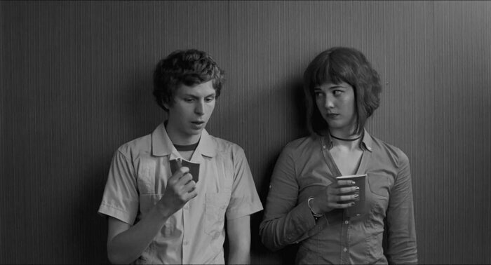
   
** How to blur image?
   Yes you can also easily blur image with =convert= tool.
   #+begin_src sh
     convert -blur 0x3 sample.jpg output.jpg
   #+end_src
   In below command =0x3= is the parameter for blur.
   /Higher the number, higher the blur./
   #+CAPTION: Output is now blurred.
   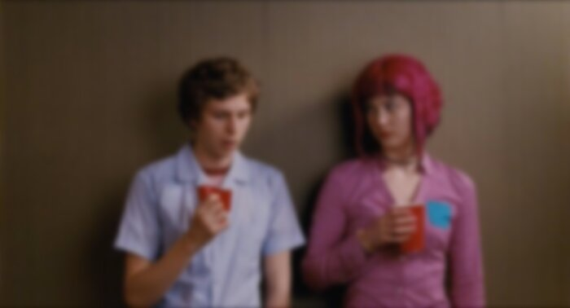

** How to emboss image?
   Emboss is a yet another effect. It is a graphics technique in
   which each pixel of an image is replaced either by a highlight
   or a shadow, depending on light/dark.
   #+begin_src sh
     convert -emboss 10 sample.jpg output.jpg
   #+end_src
   Here I =-emboss 10= where =10= is the parameter. Basically
   how much emboss you want.

   *Note*: Higher number will take more time.
   #+CAPTION: Emboss with parameter 10
   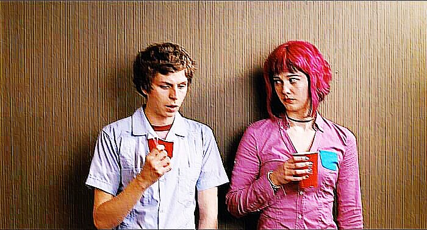

** How to shade image?
   Shade is like emboss but with 100x times brightness.
   #+begin_src sh
     convert -shade 120x45 sample.jpg output.jpg
   #+end_src
   In my case shade parameter is =120x45=. But you can play
   with these numbers. The first number is basically the depth and
   second numbers is brightness. (firstxsecond).
   #+CAPTION: Shade output with 120x45.
   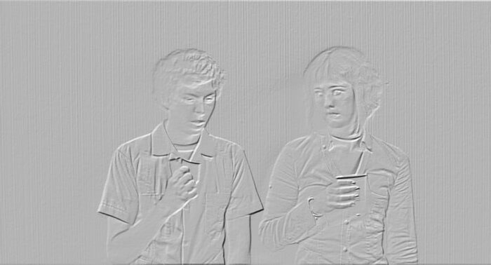

** How to charcoal image?
   Here how to charcoal a image.
   #+begin_src sh
     convert -charcoal 1 sample.jpg output.jpg
   #+end_src
   In my case the parameter is =1=. the higher the number, thicker
   the line.
   #+CAPTION: Charcoal effect with value 1. 
   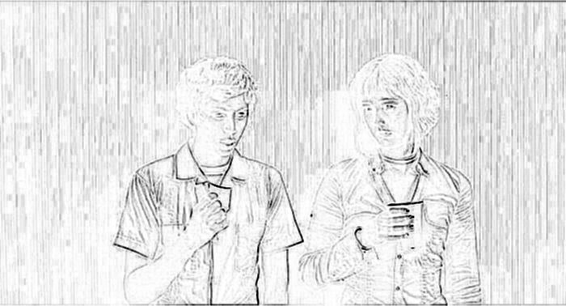
   #+CAPTION: Charcoal effect with value 25. 
   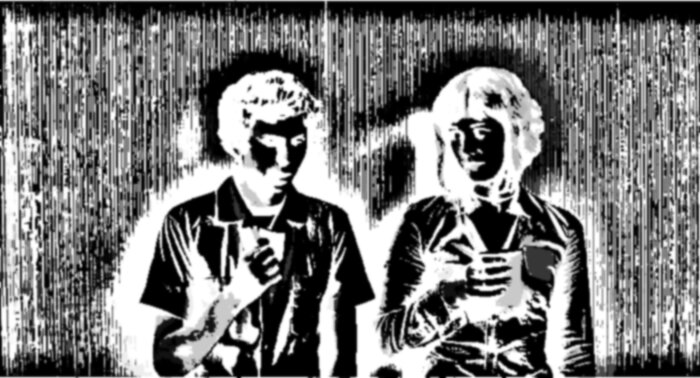

** How to change brightness of image?
   It's very useful to know changing brightness with
   imagemagick. To change brightness we have to use flag =-modulate=.
   #+begin_src sh
     convert -modulate 50 sample.jpg output.jpg
   #+end_src
   #+begin_src sh
     convert -modulate 200 sample.jpg output.jpg
   #+end_src
   - If Number less then 100 will make image darker.
     #+CAPTION: modulate value is 50 (less than 100)
     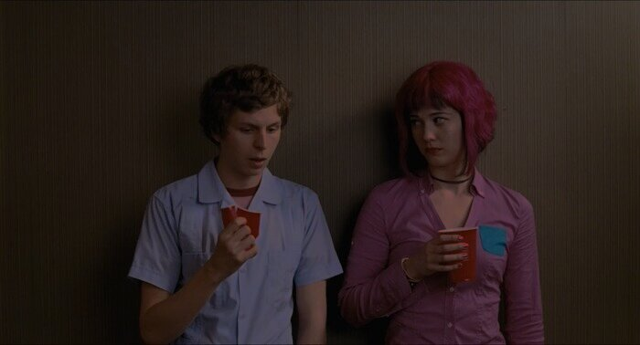
   - If Number greater than 100 will make image brighter.
     #+CAPTION: modulate value is 200 (more than 100)
     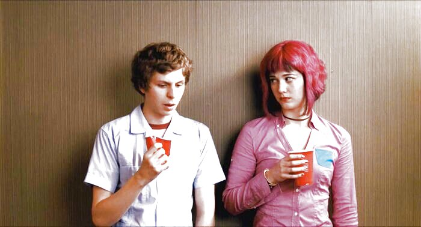
   
** How to add edge effect to image?
   Edge is another very useful effect.
   #+begin_src sh
     convert -edge 1 sample.jpg output.jpg
   #+end_src
   #+CAPTION: Output with edge parameter 1
   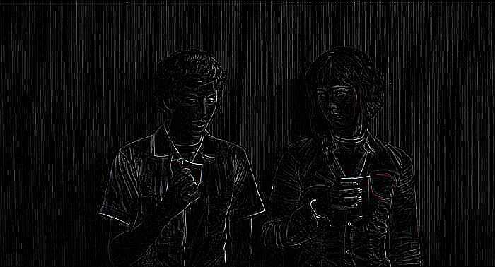   

   Lets change the edge parameter to 25. This will take time to finish.
   #+begin_src sh
     convert -edge 25 sample.jpg output.jpg
   #+end_src
   #+CAPTION: Output with edge parameter 25
   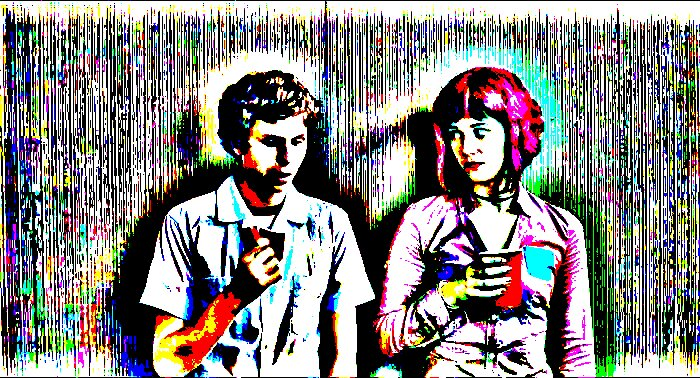   

** How to add border to image?
   Lets do something slightly unique now.
   Like adding border to an image.
   
   *Note*: Border change the size (resolution) of the image.
   #+begin_src sh
     convert -bordercolor red -border 10 sample.jpg output.jpg
   #+end_src
   - =-bordercolor= flag is for telling what border color you want.
     You can also give color with rgb values. Like this =rgb(200,0,200)=.
   - =-border= flag is for border which take a value as parameter which is
     the thickness of border.
   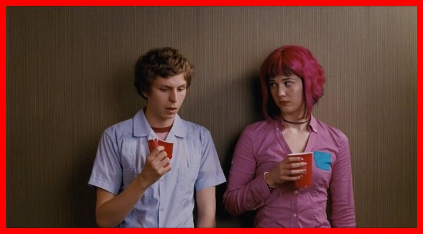
   
** How to change saturation of image?
   Here we will again use =-modulate= flag.
   #+begin_src sh
     convert -modulate 100,250 sample.jpg output.jpg
   #+end_src
   The first numbers 100 is just for brightness (in this case we are
   not changing brightness). The second numbers 250 is actually the
   value of saturation.
   #+CAPTION: Output with 250 Saturation
   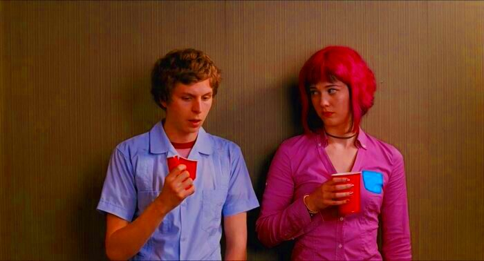
   - Any numbers greater than 100 is more saturated and
     less than 100 is less saturated.
   - You can use saturation value 0 for grayscale image.  

** How to add paint effect?
   Effect to convert image into a oil painting.
   #+begin_src sh
     convert -paint 5 sample.jpg output.jpg
   #+end_src
   #+CAPTION: Output with paint effect
   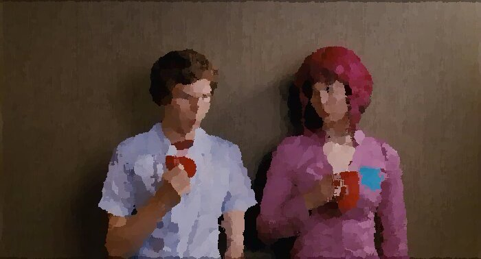

** How to solarize image?
   For adding solarize effect take percentage instead of value.
   Here the lower the percentage, the more the effect.
   #+begin_src sh
     convert -solarize 40% sample.jpg output.jpg
   #+end_src
   #+CAPTION: Output with solarized effect
   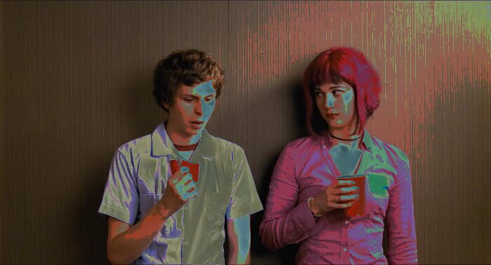

** How to add vignette effect?
   Add vignette effect quickly on your nostalgic high school photos.
   #+begin_src sh
     convert -background black -vignette 100x300 output.jpg
   #+end_src
   - Higher the numbers smoother the vignette effect is.
   #+CAPTION: Smooth vignette effect with 100x300
   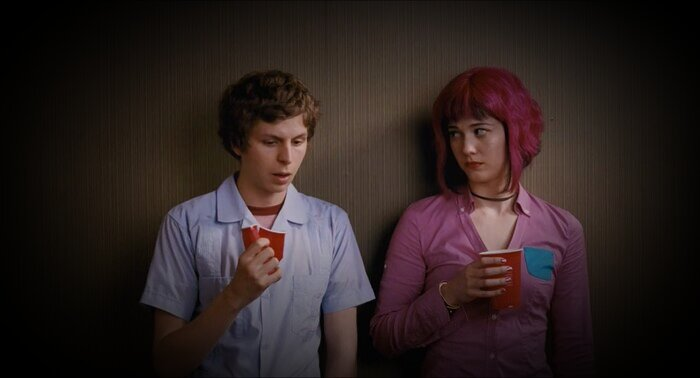
   - Lower the number stroger the effect is
   #+CAPTION: Strong vignette effect with 10x50
   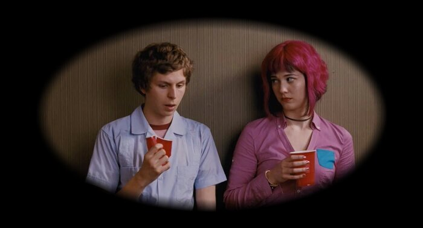
   
